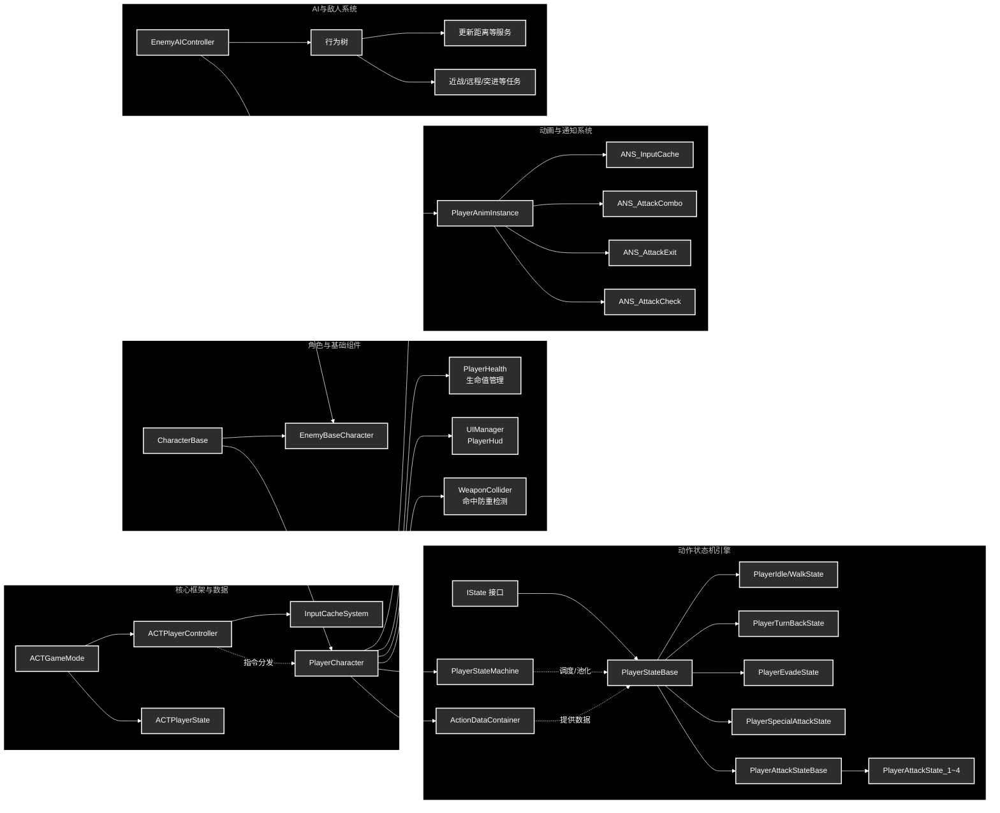
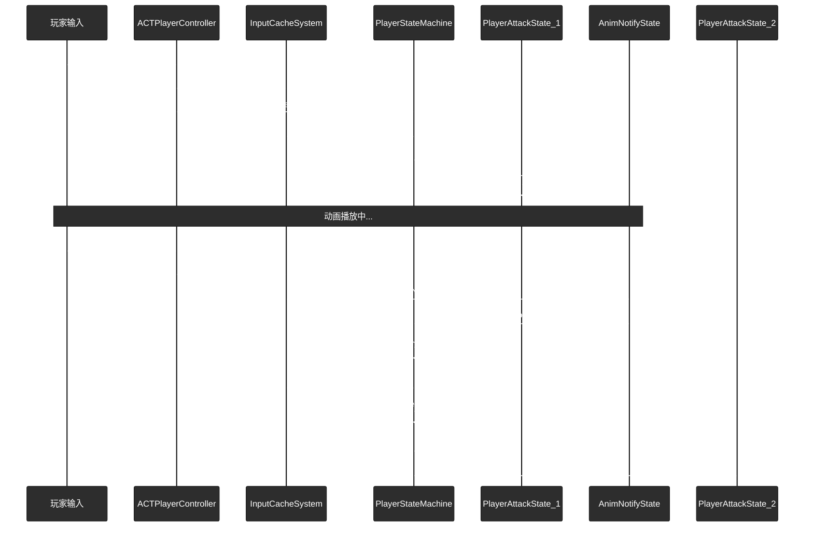

# UE5 动作游戏 (ACTGame) - 纯C++代码结构说明

基于高内聚低耦合的架构思想，本方案在 `ACTGame` 项目中建立了一套完整的纯 C++ 动作游戏框架，包含玩家控制、状态机、动画驱动、UI与生命值系统以及基于行为树的 AI 框架。

---

## 一、 系统架构图 (纯C++简化版)



---

## 二、 代码文件夹结构

项目 C++ 源码主要存放在 `Source/ACTGame/` 目录下，按照模块化划分为玩家、敌人、工具等核心模块：

```text
Source/ACTGame/
├── ACTGame.Build.cs                # 模块构建配置
├── ACTGame.h/cpp                   # 游戏主模块
├── Tools/                          # 工具模块
│   └── Log/PlayerDebug.h           # 全局调试宏
├── Enemy/                          # 敌人模块
│   ├── EnemyBaseCharacter.h/cpp    # 敌人角色基类
│   └── AI/                         # AI 与行为树
│       ├── EnemyAIController.h/cpp # 敌人 AI 控制器
│       └── BT/                     # 行为树节点 (Task / Service)
├── Player/                         # 玩家模块
│   ├── Base/                       # 玩家通用基础
│   │   ├── CharacterBase.h/cpp     # 角色通用物理与属性外壳
│   │   └── GamePlay/               # 游戏模式与状态
│   │       ├── ACTGameMode.h/cpp   # 游戏模式
│   │       └── ACTPlayerState.h/cpp# 玩家状态数据
│   ├── Character/                  # 玩家实体与控制
│   │   ├── ACTPlayerController.h/cpp # 玩家输入与指令分发
│   │   └── PlayerCharacter.h/cpp   # 玩家角色本体
│   ├── Data/                       # 数据驱动层
│   │   └── Action/                 # 动作数据容器与资产
│   ├── Health/                     # 生命值系统
│   │   └── PlayerHealth.h/cpp      # 生命值组件 (AddHealth/ReduceHealth)
│   ├── Input/                      # 输入缓存系统
│   │   └── InputCacheSystem.h/cpp  # TQueue 输入指令队列
│   ├── UI/                         # UI 系统
│   │   ├── PlayerHud.h/cpp         # 玩家 HUD 
│   │   └── UIManager.h/cpp         # UI 管理器
│   ├── Weapon/                     # 武器检测
│   │   └── WeaponCollider.h/cpp    # 命中防重检测组件
│   ├── StateMachine/               # 状态机系统
│   │   ├── IState.h                # 状态接口
│   │   ├── PlayerStateMachine.h/cpp# 状态机组件
│   │   └── States/                 # 动作状态实现 (Idle, Walk, Attack 等)
│   └── Animation/                  # 动画系统
│       ├── PlayerAnimInstance.h/cpp# 动画图表实例
│       └── AnimNotify/State/       # 动画窗口通知 (Combo, Cache, Check 等)
```

---

## 三、 C++ 类结构与文件划分

### 1. 游戏核心框架层 (Core & Framework)

*   **`ACTGameMode`**
    *   **继承对象**: `AGameModeBase`
    *   **功能**: 游戏模式类，负责配置单局游戏的核心规则和默认加载的类（如 Pawn 和 Controller）。
    *   **重要变量**: 无。
    *   **重要方法**: 构造函数中初始化默认类。

*   **`ACTPlayerState`**
    *   **继承对象**: `APlayerState`
    *   **功能**: 伴随玩家的连接存在，记录单局游戏中的玩家个人数据（如连击数、伤害和实时 DPS 等）。
    *   **重要变量**: `CurrentCombo` (当前连击数), `TotalDamage` (总伤害), `CombatStartTime` (战斗开始时间)。
    *   **重要方法**: `RecordHit` (记录命中数据), `ResetCombo` (重置连击), `GetDPS` (计算秒伤)。

*   **`PlayerDebug`**
    *   **继承对象**: 无 (宏定义头文件)
    *   **功能**: 提供全局的打印和调试宏，方便在屏幕和后台输出格式化日志。
    *   **重要变量**: 无。
    *   **重要方法**: 无。

### 2. 玩家基础与控制模块 (Player Base & Character)

*   **`CharacterBase`**
    *   **继承对象**: `ACharacter`
    *   **功能**: 所有战斗实体（包含玩家和敌人）的基础抽象外壳，处理最底层的通用属性（如生命值）和受击判定接口。
    *   **重要变量**: `Health` (生命值), `MaxHealth` (最大生命值)。
    *   **重要方法**: `ReceiveHit` (处理受击逻辑的统一入口)。

*   **`ACTPlayerController`**
    *   **继承对象**: `APlayerController`
    *   **功能**: 接收外设输入（增强输入系统），持有输入缓存组件，并将指令下发给角色或缓存队列。
    *   **重要变量**: `CurrentPlayerCharacter` (当前角色), `InputCacheSystem` (缓存系统), `IA_ACT_Move` 等输入动作。
    *   **重要方法**: `SetupInputComponent` (绑定输入), `IsInputActionTriggered` (查询按键状态), `NormalAttack` (攻击触发)。

*   **`PlayerCharacter`**
    *   **继承对象**: `ACharacterBase`
    *   **功能**: 玩家实际控制的角色实体，内部挂载并初始化状态机、输入缓存、动作数据、生命值与武器碰撞等所有玩家侧核心组件。
    *   **重要变量**: `StateMachine` (状态机), `TargetRotation` (目标朝向), `ActionDataContainer` (动作数据容器)。
    *   **重要方法**: `PlayCombatMontage` (播放战斗动画接口), `GetTargetRotation` (获取朝向)。

### 3. 数据与子系统模块 (Data, UI, Health, Input, Weapon)

*   **`ActionData`**
    *   **继承对象**: `UDataAsset`
    *   **功能**: 独立战斗动作的数据载体，负责配置特定动作的蒙太奇动画及其在连招链中的下一步走向。
    *   **重要变量**: `ActionType` (动作类型), `ActionMontage` (主蒙太奇), `NextComboState` (下一段连击状态类)。
    *   **重要方法**: 无。

*   **`ActionDataContainer`**
    *   **继承对象**: `UDataAsset`
    *   **功能**: 建立具体状态类到独立动作数据资产(`ActionData`)的映射关系字典。
    *   **重要变量**: `StateToDataMap` (状态到数据的映射表)。
    *   **重要方法**: 无。

*   **`PlayerHealth`**
    *   **继承对象**: `UActorComponent`
    *   **功能**: 玩家生命值组件，严格管理血量逻辑，向外广播生命值变更事件。
    *   **重要变量**: `CurrentHealth` (当前血量), `MaxHealth` (最大血量), `OnHealthChange` (血量变化委托)。
    *   **重要方法**: `AddHealth` (增加生命值), `ReduceHealth` (减少生命值)。

*   **`InputCacheSystem`**
    *   **继承对象**: `UActorComponent`
    *   **功能**: 输入缓存组件，维护指令队列以实现动作游戏的“连招预输入”手感机制。
    *   **重要变量**: `InputCache` (TQueue指令队列), `bShouldCache` (当前是否允许接收缓存), `MaxCacheLength`。
    *   **重要方法**: `AddCache` (指令入队), `GetCache` (取出指令), `ClearCache` (清空缓存), `SetShouldCache`。

*   **`PlayerHud`**
    *   **继承对象**: `UUserWidget`
    *   **功能**: 玩家界面的 UI 表现层基类，通常在蓝图中继承并绑定血条等进度更新逻辑。
    *   **重要变量**: 蓝图侧绑定的各种控件。
    *   **重要方法**: 蓝图实现的更新事件接口。

*   **`UIManager`**
    *   **继承对象**: `AHUD`
    *   **功能**: 管理玩家主界面 UI 的加载、初始化和销毁，监听底层事件以更新 `PlayerHud`。
    *   **重要变量**: `PlayerHudClass` (UI蓝图类), `PlayerHudInstance` (实例化UI对象)。
    *   **重要方法**: `InitializeUI` (初始化UI并挂载), `DestroyUI` (销毁UI)。

*   **`WeaponCollider`**
    *   **继承对象**: `UActorComponent`
    *   **功能**: 武器防重碰撞检测组件，利用球体追踪检测伤害目标，内部通过去重数组防止一次挥砍重复命中。
    *   **重要变量**: `WeaponComponent` (武器网格体), `ColliderObjects` (已命中对象防重列表), `HitTarget` (命中委托)。
    *   **重要方法**: `EnableCollider` (开启检测), `DisableCollider` (关闭检测), `ClearCollider` (清空防重列表)。

### 4. 状态机系统 (StateMachine)

*   **`IState`**
    *   **继承对象**: `UInterface`
    *   **功能**: 定义动作状态机中所有状态必须遵守的生命周期纯虚接口契约。
    *   **重要变量**: 无。
    *   **重要方法**: `EnterState`, `UpdateState`, `ExitState`。

*   **`PlayerStateMachine`**
    *   **继承对象**: `UActorComponent`
    *   **功能**: 状态机控制器组件，利用 `StateDic` 对象池管理所有玩家状态并调度它们的生命周期流转。
    *   **重要变量**: `CurrentState` (当前状态指针), `StateDic` (状态对象池缓存)。
    *   **重要方法**: `EnterState<T>` (泛型切换状态), `StateInvoke` (处理输入起手), `StateReInvoke` (处理连击推进), `ComboUpdate`。

*   **`PlayerStateBase`**
    *   **继承对象**: `UObject` (并实现 `IState` 接口)
    *   **功能**: 玩家动作状态的具体基类，持有角色和组件上下文，提供给子类拉取数据或推送变量的快捷函数。
    *   **重要变量**: `Character` (角色引用), `StateMachine` (状态机引用), `InputCacheSystem`。
    *   **重要方法**: `Init` (依赖注入), `GetActionData` (获取动作数据), `GetAnimInstance`, `IsInputActionTriggered`。

*   **`PlayerIdleState`**
    *   **继承对象**: `UPlayerStateBase`
    *   **功能**: 待机状态，拉取移动输入以判定是否切换至 Walk 状态。
    *   **重要变量**: 无。
    *   **重要方法**: `EnterState`, `UpdateState`。

*   **`PlayerWalkState`**
    *   **继承对象**: `UPlayerStateBase`
    *   **功能**: 移动状态，处理角色移动，并检测如果触发 180 度大转向则切换至 TurnBack 状态。
    *   **重要变量**: 无。
    *   **重要方法**: `EnterState`, `UpdateState`。

*   **`PlayerTurnBackState`**
    *   **继承对象**: `UPlayerStateBase`
    *   **功能**: 独立转身状态，将角色旋转控制权让渡给动画根运动，避免蓝图与代码控制冲突。
    *   **重要变量**: 无。
    *   **重要方法**: `EnterState`, `ExitState`。

*   **`PlayerEvadeState`**
    *   **继承对象**: `UPlayerStateBase`
    *   **功能**: 闪避状态，具备极高打断优先级，执行无敌帧和闪避位移。
    *   **重要变量**: 无。
    *   **重要方法**: `EnterState`, `ExitState`。

*   **`PlayerSpecialAttackState`**
    *   **继承对象**: `UPlayerStateBase`
    *   **功能**: 特殊攻击状态，执行基于能量或特定按键触发的高级攻击动作。
    *   **重要变量**: 无。
    *   **重要方法**: `EnterState`, `ExitState`。

*   **`PlayerAttackStateBase`**
    *   **继承对象**: `UPlayerStateBase`
    *   **功能**: 普攻链的公共抽象层，下沉了后摇退出窗口 (`CanMontageExit`) 和伤害结算的通用逻辑。
    *   **重要变量**: `bCanMontageExit` (是否处于后摇允许打断期), `BaseDamage` (基础伤害)。
    *   **重要方法**: `SetCanMontageExit`, `HandleHitTarget` (处理命中结算)。

*   **`PlayerAttackState_1`**
    *   **继承对象**: `PlayerAttackStateBase`
    *   **功能**: 普攻连招第一段实现，通过 `ActionData` 驱动获取具体动画表现。
    *   **重要变量**: 无。
    *   **重要方法**: `EnterState`, `ExitState`。

*   **`PlayerAttackState_2`**
    *   **继承对象**: `PlayerAttackStateBase`
    *   **功能**: 普攻连招第二段实现。
    *   **重要变量**: 无。
    *   **重要方法**: `EnterState`, `ExitState`。

*   **`PlayerAttackState_3`**
    *   **继承对象**: `PlayerAttackStateBase`
    *   **功能**: 普攻连招第三段实现。
    *   **重要变量**: 无。
    *   **重要方法**: `EnterState`, `ExitState`。

*   **`PlayerAttackState_4`**
    *   **继承对象**: `PlayerAttackStateBase`
    *   **功能**: 普攻连招第四段实现。
    *   **重要变量**: 无。
    *   **重要方法**: `EnterState`, `ExitState`。

### 5. 动画与通知系统 (Animation)

*   **`PlayerAnimInstance`**
    *   **继承对象**: `UAnimInstance`
    *   **功能**: 玩家动画图表实例，作为纯表现层数据容器，接收来自状态机 C++ 层的变量推送以驱动状态机流转。
    *   **重要变量**: `IsMoving`, `IsRunning`, `IsTurnBack` 等布尔状态开关。
    *   **重要方法**: `NativeUpdateAnimation` (不再处理复杂物理运算)。

*   **`ANS_InputCache`**
    *   **继承对象**: `UAnimNotifyState`
    *   **功能**: 预输入窗口期通知，控制在蒙太奇特定区间内开启 `InputCacheSystem` 允许录入玩家的下一招指令。
    *   **重要变量**: 无。
    *   **重要方法**: `NotifyBegin` (开启缓存), `NotifyEnd` (关闭缓存)。

*   **`ANS_AttackCombo`**
    *   **继承对象**: `UAnimNotifyState`
    *   **功能**: 连招判定窗口通知，在持续区间内向状态机发送轮询信号，尝试消费缓存并派生下一段连击。
    *   **重要变量**: 无。
    *   **重要方法**: `NotifyBegin`, `NotifyTick` (执行 `ComboUpdate`)。

*   **`ANS_AttackExit`**
    *   **继承对象**: `UAnimNotifyState`
    *   **功能**: 攻击后摇可打断窗口通知，标志着伤害已结算，允许被移动或闪避强制切出。
    *   **重要变量**: 无。
    *   **重要方法**: `NotifyBegin` (设置 `CanMontageExit = true`), `NotifyEnd`。

*   **`ANS_AttackCheck`**
    *   **继承对象**: `UAnimNotifyState`
    *   **功能**: 命中检测控制窗口通知，在特定帧区间启用武器物理碰撞球追踪。
    *   **重要变量**: 无。
    *   **重要方法**: `NotifyBegin` (调用 `EnableCollider`), `NotifyEnd` (调用 `DisableCollider`)。

### 6. 敌人 AI 与行为树 (Enemy/AI)

*   **`EnemyBaseCharacter`**
    *   **继承对象**: `ACharacterBase`
    *   **功能**: 敌人基类，提供眩晕等负面状态开关及近战/远程/突进的蓝图可重写行为接口。
    *   **重要变量**: `bIsStunned` (眩晕标志), `OnStunChanged` (状态变更委托)。
    *   **重要方法**: `SetStunned`, `DoMeleeAttack`, `DoRangedAttack`, `DoDash`。

*   **`EnemyAIController`**
    *   **继承对象**: `AAIController`
    *   **功能**: 敌人的大脑控制器，接管视觉感知并驱动默认行为树，具备在眩晕后暂停和恢复 AI 逻辑的能力。
    *   **重要变量**: `DefaultBehaviorTree` (行为树资产), `TargetActorKeyName`, `SightConfig` (视觉配置)。
    *   **重要方法**: `HandlePerceptionUpdated`, `HandleStunChanged`, `ResumeLogicAfterStun`。

*   **`BTService_UpdateDistanceToTarget`**
    *   **继承对象**: `UBTService_BlackboardBase`
    *   **功能**: 行为树服务节点，在 Tick 时计算 AI 与玩家目标间的实时距离并写入黑板。
    *   **重要变量**: `DistanceKey` (绑定的距离黑板键)。
    *   **重要方法**: `TickNode` (执行距离计算)。

*   **`BTTask_DashLastKnownDirection`**
    *   **继承对象**: `UBTTaskNode`
    *   **功能**: 行为树任务节点，使 AI 向最后已知的玩家位置进行高速突进移动。
    *   **重要变量**: `LastKnownLocationKey`, `DashSpeed` (突进速度), `DashDuration` (突进持续时间)。
    *   **重要方法**: `ExecuteTask`, `TickTask`。

*   **`BTTask_IdleThenRetreat`**
    *   **继承对象**: `UBTTaskNode`
    *   **功能**: 行为树任务节点，使 AI 在原地待机指定时间后，向后撤退以拉开与玩家的距离。
    *   **重要变量**: `IdleSeconds` (待机时间), `RetreatDistance` (撤退距离)。
    *   **重要方法**: `ExecuteTask`, `TickTask`。

*   **`BTTask_MeleeConeAttack`**
    *   **继承对象**: `UBTTaskNode`
    *   **功能**: 行为树任务节点，对前方指定角度和半径的扇形区域内的玩家执行近战伤害结算。
    *   **重要变量**: `TargetActorKey`, `Damage` (伤害值), `ConeRange` (扇形半径), `ConeAngleDegrees` (扇形角度)。
    *   **重要方法**: `ExecuteTask`。

*   **`BTTask_RangedAttack`**
    *   **继承对象**: `UBTTaskNode`
    *   **功能**: 行为树任务节点，朝玩家方向发起远程攻击（可配置为直接命中伤害或通过蓝图发射投射物）。
    *   **重要变量**: `TargetActorKey`, `Damage` (伤害值), `MaxRange` (最大攻击距离), `bInstantHit` (是否瞬发)。
    *   **重要方法**: `ExecuteTask`。

---

## 四、 核心逻辑时序图

### 1. 战斗连击与缓存调度时序



### 2. 武器命中检测流程

```mermaid
%%{init: {'theme': 'base', 'themeVariables': { 'background': '#000000', 'primaryColor': '#2D2D2D', 'primaryTextColor': '#FFFFFF', 'lineColor': '#FFFFFF', 'noteBkgColor': '#2D2D2D', 'noteTextColor': '#FFFFFF'}}}%%
sequenceDiagram
    participant ANS as ANS_AttackCheck
    participant WC as WeaponCollider
    participant SM as PlayerAttackStateBase
    participant Enemy as EnemyBaseCharacter
    participant Health as PlayerHealth

    ANS->>WC: NotifyBegin -> EnableCollider()
    
    rect rgb(45, 45, 45)
        note right of WC: 碰撞检测开启
        WC->>WC: SphereTraceMultiForObjects()
        WC->>WC: 判断命中物体是否在 ColliderObjects
        WC->>WC: 新目标加入 ColliderObjects
        WC->>SM: 触发 HitTarget(HitObject) 事件
    end
    
    SM->>Enemy: ApplyPointDamage(HitObject)
    Enemy->>Health: ReduceHealth(Damage)
    Health->>Health: OnHealthChange.Broadcast()
    
    ANS->>WC: NotifyEnd -> DisableCollider()
```



---

## 五、 架构总结与优势

1. **职责分离极致化**：输入、逻辑调度、动作表现三层彻底剥离。输入缓存队列消除手感粘滞，动画图表变为纯被动状态，真正实现了所见即所得。
2. **内存与性能优化**：状态机组件通过对象池 `StateDic` 管理状态复用，避免连击期间高频创建和销毁 `UObject` 对象。
3. **规范化的数据流**：无论是生命值管理的 `AddHealth` / `ReduceHealth`，还是碰撞检测的 `EnableCollider` / `HitObject` 模型，都保证了内部数据修改的高度收敛。
4. **易于扩展的 AI 模块**：加入了完整的行为树基础设施，使用 Service 与 Task 搭配实现了模块化的敌人 AI 逻辑。
