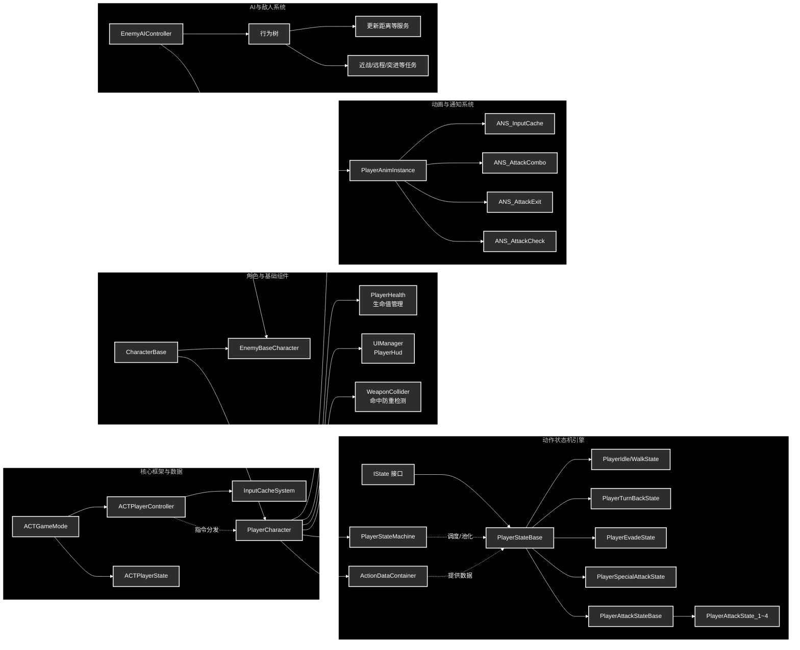
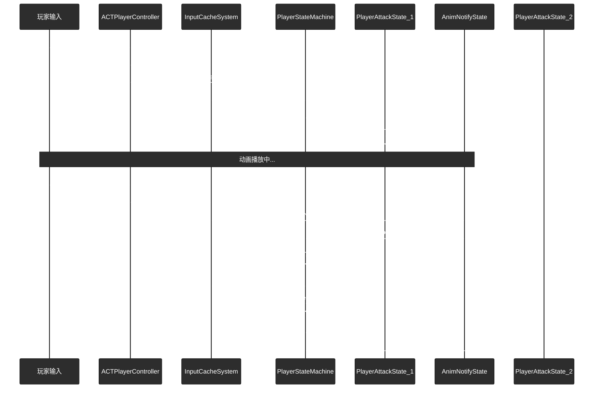
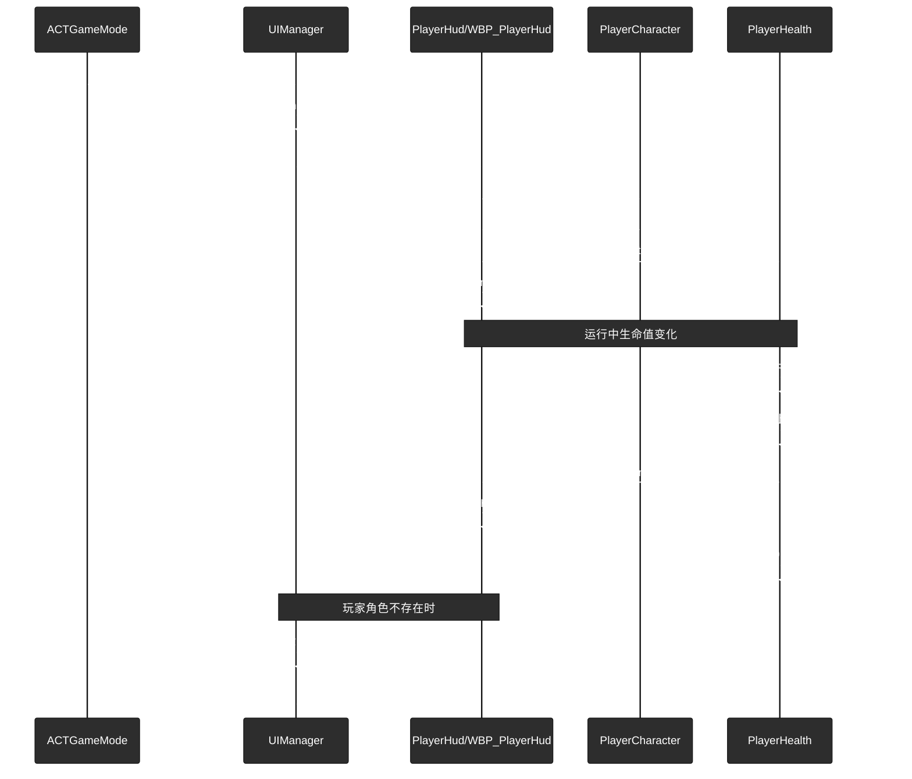

# UE5 动作游戏 (ACTGame) - 纯C++代码结构说明

基于高内聚低耦合的架构思想，本方案在 `ACTGame` 项目中建立了一套完整的纯 C++ 动作游戏框架，包含玩家控制、状态机、动画驱动、UI与生命值系统以及基于行为树的 AI 框架。

---

# 一、 系统架构图 (纯C++简化版)



---

# 二、 代码文件夹结构

项目 C++ 源码主要存放在 `Source/ACTGame/` 目录下，按照模块化划分为玩家、敌人、工具等核心模块：

```text
Source/ACTGame/
├── ACTGame.Build.cs                # 模块构建配置
├── ACTGame.h/cpp                   # 游戏主模块
├── Tools/                          # 工具模块
│   └── Log/PlayerDebug.h           # 全局调试宏
├── Enemy/                          # 敌人模块
│   ├── EnemyBaseCharacter.h/cpp    # 敌人角色基类
│   └── AI/                         # AI 与行为树
│       ├── EnemyAIController.h/cpp # 敌人 AI 控制器
│       └── BT/                     # 行为树节点 (Task / Service)
├── Player/                         # 玩家模块
│   ├── Base/                       # 玩家通用基础
│   │   ├── CharacterBase.h/cpp     # 角色通用物理与属性外壳
│   │   └── GamePlay/               # 游戏模式与状态
│   │       ├── ACTGameMode.h/cpp   # 游戏模式
│   │       └── ACTPlayerState.h/cpp# 玩家状态数据
│   ├── Character/                  # 玩家实体与控制
│   │   ├── ACTPlayerController.h/cpp # 玩家输入与指令分发
│   │   └── PlayerCharacter.h/cpp   # 玩家角色本体
│   ├── Data/                       # 数据驱动层
│   │   └── Action/                 # 动作数据容器与资产
│   ├── Health/                     # 生命值系统
│   │   └── PlayerHealth.h/cpp      # 生命值组件 (AddHealth/ReduceHealth/OnPlayerDeath)
│   ├── Input/                      # 输入缓存系统
│   │   └── InputCacheSystem.h/cpp  # TQueue 输入指令队列
│   ├── UI/                         # UI 系统
│   │   ├── PlayerHud.h/cpp         # 玩家 HUD 
│   │   └── UIManager.h/cpp         # UI 管理器
│   ├── Weapon/                     # 武器检测
│   │   └── WeaponCollider.h/cpp    # 命中防重检测组件
│   ├── StateMachine/               # 状态机系统
│   │   ├── IState.h                # 状态接口
│   │   ├── PlayerStateMachine.h/cpp# 状态机组件
│   │   └── States/                 # 动作状态实现 (Idle, Walk, Attack 等)
│   └── Animation/                  # 动画系统
│       ├── PlayerAnimInstance.h/cpp# 动画图表实例
│       └── AnimNotify/State/       # 动画窗口通知 (Combo, Cache, Check 等)
```

---

# 三、 C++ 类结构与文件划分

## 3.1 Tools
包含项目工具与辅助逻辑。

### 3.1.1 Tools/Log
包含调试输出相关的辅助定义。

**`PlayerDebug.h`**
*   **继承对象**: 无（宏定义头文件）
*   **功能**: 提供全局调试输出宏，方便在屏幕与日志中快速打印调试信息。
*   **重要变量**: 无。
*   **重要方法**: 无。

---

## 3.2 Player
包含玩家角色、战斗、动画与 UI 相关逻辑。

### 3.2.1 Player/Base
包含玩家与敌人共用的基础角色定义。

**`CharacterBase.h / .cpp`**
*   **继承对象**: `ACharacter`
*   **功能**: 所有战斗实体（包括玩家和敌人）的基础外壳类，负责处理角色最底层的通用属性和行为，例如物理碰撞与受击接口约定。
*   **重要变量**: 无。
*   **重要方法**:
    *   `ReceiveHit(float DamageAmount)`: 统一受击入口，由具体子类决定是否以及如何实现。

### 3.2.2 Player/Base/GamePlay
包含关卡规则与玩家局内统计逻辑。

**`ACTGameMode.h / .cpp`**
*   **继承对象**: `AGameModeBase`
*   **功能**: 基础游戏模式类，负责配置单局游戏的核心规则以及默认加载的 Pawn、Controller 和 PlayerState。
*   **重要变量**: 无。
*   **重要方法**:
    *   `AACTGameMode()`: 在构造函数中设置默认类。

**`ACTPlayerState.h / .cpp`**
*   **继承对象**: `APlayerState`
*   **功能**: 保存伴随玩家连接存在的战斗数据，适合记录单局内的连击、伤害和 DPS 等信息。
*   **重要变量**:
    *   `CurrentCombo`: 当前连击数。
    *   `TotalDamage`: 累计总伤害。
    *   `CombatStartTime`: 战斗开始时间戳。
    *   `bIsInCombat`: 是否处于战斗状态。
*   **重要方法**:
    *   `RecordHit(float DamageAmount)`: 记录一次新的命中并增加统计数据。
    *   `ResetCombo()`: 重置当前连击数。
    *   `ResetCombatStats()`: 重置整场战斗统计。
    *   `GetDPS()`: 计算当前 DPS。

### 3.2.3 Player/Character
包含玩家控制器与玩家角色本体定义。

**`ACTPlayerController.h / .cpp`**
*   **继承对象**: `APlayerController`
*   **功能**: 统一接收玩家外设输入，配置 Enhanced Input，并把移动、攻击、闪避等指令分发给角色或输入缓存系统。
*   **重要变量**:
    *   `CurrentPlayerCharacter`: 当前控制的玩家角色引用。
    *   `IMC_ACT`: 输入映射上下文。
    *   `IA_ACT_Move`、`IA_ACT_Look`、`IA_NormalAttack`、`IA_SpecialAttack`、`IA_Evade`: 各类输入动作。
    *   `InputCacheSystem`: 输入缓存系统组件。
    *   `EvadeCooldownTimer`: 闪避冷却计时器。
    *   `EvadeCooldownDuration`: 闪避冷却时长。
*   **重要方法**:
    *   `SetupInputComponent()`: 绑定输入映射和输入回调。
    *   `IsInputActionTriggered(const UInputAction* Action)`: 查询某个输入动作当前是否被触发。
    *   `GetInputActionValue(const UInputAction* Action)`: 获取某个输入动作的当前值。
    *   `Move(const FInputActionValue& Value)`: 处理移动输入。
    *   `Look(const FInputActionValue& Value)`: 处理镜头输入。
    *   `NormalAttack()`: 处理普通攻击起手和输入缓存。
    *   `SpecialAttack()`: 处理特殊攻击起手和输入缓存。
    *   `Evade()`: 处理闪避输入和冷却逻辑。

**`PlayerCharacter.h / .cpp`**
*   **继承对象**: `ACharacterBase`
*   **功能**: 玩家实际操控的角色实体，管理相机、状态机、动作数据、生命值和武器碰撞组件，并向状态系统暴露动画和朝向接口。
*   **重要变量**:
    *   `CameraBoom`: 摄像机摇臂组件。
    *   `FollowCamera`: 跟随摄像机组件。
    *   `StateMachine`: 玩家状态机组件。
    *   `TargetRotation`: 角色缓存目标朝向。
    *   `ActionDataContainer`: 动作数据容器。
    *   `WeaponCollider`: 武器碰撞组件。
    *   `PlayerHealth`: 玩家生命值组件。
    *   `Weapon`: 武器静态网格体组件。
*   **重要方法**:
    *   `PlayCombatMontage(UAnimMontage* Montage)`: 供状态机调用的战斗蒙太奇播放接口。
    *   `GetTargetRotation() / SetTargetRotation()`: 获取或设置目标旋转。
    *   `GetStateMachine()`: 获取状态机组件。
    *   `GetActionDataContainer()`: 获取动作数据容器。
    *   `GetPlayerHealth()`: 获取生命值组件。

### 3.2.4 Player/Data/Action

包含动作系统的数据资产定义。

**`ActionData.h / .cpp`**
*   **继承对象**: `UDataAsset`
*   **功能**: 单个战斗动作的数据载体，用于配置某个动作的类型、主蒙太奇、备用蒙太奇以及连段派生目标状态。
*   **重要变量**:
    *   `ActionType`: 动作类型枚举。
    *   `ActionMontage`: 当前动作主蒙太奇。
    *   `ExtraMontages`: 备用或分支蒙太奇数组。
    *   `NextComboState`: 下一段连击状态类。
*   **重要方法**: 无。

**`ActionDataContainer.h / .cpp`**
*   **继承对象**: `UDataAsset`
*   **功能**: 建立“状态类 -> 动作数据资产”的映射关系，让状态机可以按当前状态类型读取对应动作配置。
*   **重要变量**:
    *   `StateToDataMap`: 状态类到动作数据的映射表。
*   **重要方法**: 无。

### 3.2.5 Player/Health

包含生命值与血量广播逻辑。

**`PlayerHealth.h / .cpp`**
*   **继承对象**: `UActorComponent`
*   **功能**: 玩家生命值组件，负责统一管理加血、扣血以及血量/死亡事件广播。
*   **重要变量**:
    *   `MaxHealth`: 最大生命值。
    *   `CurrentHealth`: 当前生命值。
    *   `OnHealthChange`: 血量变化委托。
    *   `OnPlayerDeath`: 玩家死亡事件委托。
*   **重要方法**:
    *   `AddHealth(float HealthAmount)`: 增加生命值。
    *   `ReduceHealth(float HealthAmount)`: 减少生命值，并在生命值归零时广播死亡事件。
    *   `GetCurrentHealth()`: 获取当前血量。
    *   `GetMaxHealth()`: 获取最大血量。

### 3.2.6 Player/Input

包含动作输入缓存与预输入逻辑。

**`InputCacheSystem.h / .cpp`**
*   **继承对象**: `UActorComponent`
*   **功能**: 动作游戏核心输入缓存组件，通过 FIFO 队列保存预输入指令，并配合动画通知决定何时允许写入与消费缓存。
*   **重要变量**:
    *   `InputCache`: 存储输入指令的 `TQueue` 队列。
    *   `CurrentCacheCount`: 当前缓存数量。
    *   `MaxCacheLength`: 最大缓存长度。
    *   `bShouldCache`: 当前是否允许接收新缓存。
*   **重要方法**:
    *   `AddCache(EInputType Input)`: 添加输入到缓存队列。
    *   `GetCache(EInputType& OutInput)`: 取出并移除队首输入。
    *   `ClearCache()`: 清空缓存。
    *   `SetShouldCache(bool bNewShouldCache)`: 设置是否允许缓存。
    *   `GetShouldCache()`: 查询当前缓存开关状态。

### 3.2.7 Player/UI

包含玩家界面实例与管理逻辑。

**`PlayerHud.h / .cpp`**
*   **继承对象**: `UUserWidget`
*   **功能**: 玩家 HUD 界面基类，负责接收玩家对象和生命值组件引用，并把血量变化同步到 UI 表现层。
*   **重要变量**: 无显式成员变量定义在头文件中。
*   **重要方法**:
    *   `NativeConstruct()`: Widget 构建完成后的初始化入口。
    *   `InitializePlayerHud(APlayerCharacter* PlayerCharacter)`: 使用玩家角色初始化 HUD。
    *   `UpdateHealth(float CurrentHealth, float MaxHealth)`: 更新界面中的血量表现。
    *   `BindPlayerHealth(UPlayerHealth* NewPlayerHealth)`: 绑定生命值组件事件。

**`UIManager.h / .cpp`**
*   **继承对象**: `AHUD`
*   **功能**: UI 管理器，负责创建、初始化、持有和销毁玩家 HUD 实例。
*   **重要变量**:
    *   `PlayerHudClass`: HUD 蓝图类。
    *   `PlayerHudInstance`: 已创建的 HUD 实例。
*   **重要方法**:
    *   `InitializeUI()`: 初始化 UI。
    *   `GetPlayerHud()`: 获取当前 HUD 实例。
    *   `DestroyUI()`: 销毁当前 UI。

### 3.2.8 Player/Weapon

包含武器命中检测相关逻辑。

**`WeaponCollider.h / .cpp`**
*   **继承对象**: `UActorComponent`
*   **功能**: 武器碰撞检测组件，在启用期间通过武器插槽执行球体追踪，并用去重列表防止同一攻击窗口重复命中同一对象。
*   **重要变量**:
    *   `WeaponComponent`: 参与检测的武器网格体组件。
    *   `isCollider`: 当前是否开启碰撞检测。
    *   `ColliderObjects`: 当前窗口已命中的对象列表。
    *   `StartSocket` / `StopSocket`: 轨迹检测起止插槽名。
    *   `TraceRadius`: 球体追踪半径。
    *   `TraceObjectTypes`: 参与检测的对象类型。
    *   `HitTarget`: 命中事件委托。
*   **重要方法**:
    *   `SetWeaponComponent(UStaticMeshComponent* Weapon)`: 设置武器组件引用。
    *   `EnableCollider()`: 开启命中检测。
    *   `DisableCollider()`: 关闭命中检测。
    *   `ClearCollider()`: 清空已命中对象列表。
    *   `GetWeaponComponent()`: 获取当前武器组件。

### 3.2.9 Player/StateMachine

包含状态机接口与调度逻辑。

**`IState.h`**
*   **继承对象**: `UInterface`
*   **功能**: 定义所有玩家状态必须遵守的生命周期接口约束。
*   **重要变量**: 无。
*   **重要方法**:
    *   `EnterState()`: 进入状态时调用。
    *   `UpdateState(float DeltaTime)`: 状态更新时调用。
    *   `ExitState()`: 退出状态时调用。

**`PlayerStateMachine.h / .cpp`**
*   **继承对象**: `UActorComponent`
*   **功能**: 玩家状态机组件，负责管理当前状态、对象池缓存以及连招输入的起手与派生调度。
*   **重要变量**:
    *   `CurrentState`: 当前激活状态。
    *   `StateDic`: 状态对象池缓存。
*   **重要方法**:
    *   `EnterState(UClass* StateClass)`: 按类切换状态。
    *   `EnterState<T>()`: 泛型切换状态入口。
    *   `StateInvoke(EInputType InputType)`: 处理输入起手请求。
    *   `StateReInvoke(EInputType InputType)`: 处理状态重入和连段推进。
    *   `ComboUpdate()`: 消费缓存并尝试触发下一段连击。
    *   `Stop()`: 强制停止状态机。
    *   `GetCurrentState()`: 获取当前状态对象。

### 3.2.10 Player/StateMachine/States

包含所有具体状态共用的基类。

**`PlayerStateBase.h / .cpp`**
*   **继承对象**: `UObject`，并实现 `IState`
*   **功能**: 所有玩家具体状态的公共基类，统一保存角色、状态机和输入缓存引用，并提供访问动画实例和动作数据的快捷接口。
*   **重要变量**:
    *   `Character`: 宿主角色引用。
    *   `StateMachine`: 宿主状态机引用。
    *   `InputCacheSystem`: 输入缓存系统引用。
*   **重要方法**:
    *   `Init(APlayerCharacter* InCharacter, UPlayerStateMachine* InStateMachine, UInputCacheSystem* InInputCacheSystem)`: 初始化状态依赖。
    *   `GetActionData()`: 获取当前状态对应的动作数据。
    *   `GetAnimInstance()`: 获取动画实例。
    *   `GetInputCacheSystem()`: 获取输入缓存组件。
    *   `IsInputActionTriggered(const UInputAction* Action)`: 查询输入触发状态。
    *   `GetInputActionValue(const UInputAction* Action)`: 查询输入值。

### 3.2.11 Player/StateMachine/States/Locomotion

包含待机、移动、转身等位移逻辑。

**`PlayerIdleState.h / .cpp`**
*   **继承对象**: `UPlayerStateBase`
*   **功能**: 玩家待机状态，负责在无输入时维持静止表现，并在检测到移动输入时切入移动状态。
*   **重要变量**: 无。
*   **重要方法**:
    *   `EnterState()`
    *   `UpdateState(float DeltaTime)`
    *   `ExitState()`

**`PlayerWalkState.h / .cpp`**
*   **继承对象**: `UPlayerStateBase`
*   **功能**: 玩家移动状态，负责处理角色移动更新、跑步启动判定以及转身前的防抖判断。
*   **重要变量**:
    *   `TurnBackTimer`: 转身防手抖计时器。
    *   `CheckRunTimer`: 跑步启动计时器。
*   **重要方法**:
    *   `EnterState()`
    *   `UpdateState(float DeltaTime)`
    *   `ExitState()`

**`PlayerTurnBackState.h / .cpp`**
*   **继承对象**: `UPlayerStateBase`
*   **功能**: 独立转身状态，处理大角度急停转身逻辑，并在动画结束后切回 Idle 或 Walk。
*   **重要变量**: 无。
*   **重要方法**:
    *   `EnterState()`
    *   `UpdateState(float DeltaTime)`
    *   `ExitState()`

### 3.2.12 Player/StateMachine/States/Combo/Attack

包含攻击状态的公共逻辑。

**`PlayerAttackStateBase.h / .cpp`**
*   **继承对象**: `UPlayerStateBase`
*   **功能**: 所有攻击类状态的公共基类，负责命中回调绑定、后摇退出窗口控制和基础伤害逻辑。
*   **重要变量**:
    *   `bCanMontageExit`: 是否允许在后摇阶段退出当前攻击。
    *   `BaseDamage`: 基础伤害值。
*   **重要方法**:
    *   `EnterState()`: 进入攻击状态时初始化公共逻辑。
    *   `ExitState()`: 退出攻击状态时清理公共逻辑。
    *   `SetCanMontageExit(bool bInCanMontageExit)`: 设置是否允许退出蒙太奇。
    *   `GetCanMontageExit()`: 获取当前退出窗口状态。
    *   `HandleHitTarget(const FHitResult& HitObject)`: 处理命中目标后的伤害结算。

### 3.2.13 Player/StateMachine/States/Combo/Attack/Normal

包含普通攻击各段的具体逻辑。

**`PlayerAttackState_1.h / .cpp`**
*   **继承对象**: `UPlayerAttackStateBase`
*   **功能**: 普攻第一段状态，负责播放第一段攻击动画并在蒙太奇结束后驱动状态流转。
*   **重要变量**:
    *   `AttackMontage`: 当前状态使用的攻击蒙太奇。
*   **重要方法**:
    *   `EnterState()`
    *   `UpdateState(float DeltaTime)`
    *   `ExitState()`
    *   `OnMontageEnded(UAnimMontage* Montage, bool bInterrupted)`: 处理攻击蒙太奇结束事件。

**`PlayerAttackState_2.h / .cpp`**
*   **继承对象**: `UPlayerAttackStateBase`
*   **功能**: 普攻第二段状态，负责第二段攻击蒙太奇播放与结束回调处理。
*   **重要变量**:
    *   `AttackMontage`: 当前状态使用的攻击蒙太奇。
*   **重要方法**:
    *   `EnterState()`
    *   `UpdateState(float DeltaTime)`
    *   `ExitState()`
    *   `OnMontageEnded(UAnimMontage* Montage, bool bInterrupted)`: 处理攻击蒙太奇结束事件。

**`PlayerAttackState_3.h / .cpp`**
*   **继承对象**: `UPlayerAttackStateBase`
*   **功能**: 普攻第三段状态，负责第三段攻击蒙太奇播放与结束回调处理。
*   **重要变量**:
    *   `AttackMontage`: 当前状态使用的攻击蒙太奇。
*   **重要方法**:
    *   `EnterState()`
    *   `UpdateState(float DeltaTime)`
    *   `ExitState()`
    *   `OnMontageEnded(UAnimMontage* Montage, bool bInterrupted)`: 处理攻击蒙太奇结束事件。

**`PlayerAttackState_4.h / .cpp`**
*   **继承对象**: `UPlayerAttackStateBase`
*   **功能**: 普攻第四段状态，负责末段攻击蒙太奇播放与结束回调处理。
*   **重要变量**:
    *   `AttackMontage`: 当前状态使用的攻击蒙太奇。
*   **重要方法**:
    *   `EnterState()`
    *   `UpdateState(float DeltaTime)`
    *   `ExitState()`
    *   `OnMontageEnded(UAnimMontage* Montage, bool bInterrupted)`: 处理攻击蒙太奇结束事件。

### 3.2.14 Player/StateMachine/States/Combo/Attack/Special

包含特殊攻击状态逻辑。

**`PlayerSpecialAttackState.h / .cpp`**
*   **继承对象**: `UPlayerAttackStateBase`
*   **功能**: 特殊攻击状态，负责播放特殊攻击动画并在结束后完成状态切换。
*   **重要变量**:
    *   `AttackMontage`: 特殊攻击使用的蒙太奇。
*   **重要方法**:
    *   `EnterState()`
    *   `UpdateState(float DeltaTime)`
    *   `ExitState()`
    *   `OnMontageEnded(UAnimMontage* Montage, bool bInterrupted)`: 处理特殊攻击动画结束事件。

### 3.2.15 Player/StateMachine/States/Combo/Evade

包含闪避相关状态逻辑。

**`PlayerEvadeState.h / .cpp`**
*   **继承对象**: `UPlayerAttackStateBase`
*   **功能**: 玩家闪避状态，负责根据输入方向播放前闪或后闪动画，并在需要时让角色平滑跟随输入方向旋转。
*   **重要变量**:
    *   `AM_Evade_Front`: 前闪蒙太奇。
    *   `AM_Evade_Back`: 后闪蒙太奇。
    *   `CharacterRotateSpeed`: 闪避期间角色旋转速度。
    *   `bShouldRotate`: 是否需要跟随输入平滑转向。
*   **重要方法**:
    *   `EnterState()`
    *   `UpdateState(float DeltaTime)`
    *   `ExitState()`
    *   `OnMontageEnded(UAnimMontage* Montage, bool bInterrupted)`: 处理闪避动画结束事件。

### 3.2.16 Player/Animation

包含动画实例与表现层变量定义。

**`PlayerAnimInstance.h / .cpp`**
*   **继承对象**: `UAnimInstance`
*   **功能**: 玩家动画实例，作为动画图表的数据容器，接收状态机推送的状态变量来驱动最终表现。
*   **重要变量**:
    *   `IsMoving`: 是否处于移动状态。
    *   `IsRunning`: 是否处于跑步状态。
    *   `IsIdleAFK`: 是否处于待机挂机状态。
    *   `IsTurnBack`: 是否正在转身。
    *   `TurnBackTimer`: 转身计时变量。
*   **重要方法**:
    *   `NativeUpdateAnimation(float DeltaSeconds)`: 动画更新入口。

### 3.2.17 Player/Animation/AnimNotify/State

包含动画通知驱动的窗口控制逻辑。

**`ANS_InputCache.h / .cpp`**
*   **继承对象**: `UAnimNotifyState`
*   **功能**: 输入缓存窗口通知，控制某段动画期间是否允许把预输入写入 `InputCacheSystem`。
*   **重要变量**: 无。
*   **重要方法**:
    *   `NotifyBegin(...)`: 开启输入缓存窗口。
    *   `NotifyTick(...)`: 窗口期间逐帧处理。
    *   `NotifyEnd(...)`: 关闭输入缓存窗口。

**`ANS_AttackCombo.h / .cpp`**
*   **继承对象**: `UAnimNotifyState`
*   **功能**: 连击检测窗口通知，在持续区间内轮询状态机的 `ComboUpdate()` 来尝试消费缓存输入。
*   **重要变量**: 无。
*   **重要方法**:
    *   `NotifyBegin(...)`: 进入连击判定窗口。
    *   `NotifyTick(...)`: 连击窗口内持续检测。

**`ANS_AttackExit.h / .cpp`**
*   **继承对象**: `UAnimNotifyState`
*   **功能**: 攻击退出窗口通知，在攻击后摇阶段打开可打断窗口，允许移动或其他动作切走当前状态。
*   **重要变量**: 无。
*   **重要方法**:
    *   `NotifyBegin(...)`: 打开攻击退出窗口。
    *   `NotifyTick(...)`: 窗口内检查是否需要提前退出。
    *   `NotifyEnd(...)`: 关闭攻击退出窗口。

**`ANS_AttackCheck.h / .cpp`**
*   **继承对象**: `UAnimNotifyState`
*   **功能**: 命中检测窗口通知，在有效攻击帧内启用 `WeaponCollider`，结束时关闭检测。
*   **重要变量**: 无。
*   **重要方法**:
    *   `NotifyBegin(...)`: 开启武器碰撞检测。
    *   `NotifyTick(...)`: 命中窗口逐帧处理。
    *   `NotifyEnd(...)`: 关闭武器碰撞检测。

## 3.3 Enemy

包含敌人角色、AI 与行为树相关逻辑。

### 3.3.1 Enemy

包含敌人角色基础定义。

**`EnemyBaseCharacter.h / .cpp`**
*   **继承对象**: `ACharacterBase`
*   **功能**: 敌人基础角色类，负责管理敌人自身生命值、受击逻辑，并扩展眩晕状态控制以及近战、远程、突进等蓝图可重写行为接口。
*   **重要变量**:
    *   `Health`: 当前生命值。
    *   `MaxHealth`: 最大生命值。
    *   `bIsStunned`: 当前是否处于眩晕状态。
    *   `OnStunChanged`: 眩晕状态变化委托。
*   **重要方法**:
    *   `ReceiveHit(float DamageAmount)`: 处理敌人受击与扣血逻辑。
    *   `SetStunned(bool bNewStunned)`: 设置眩晕状态。
    *   `IsStunned()`: 获取当前眩晕状态。
    *   `DoMeleeAttack()`: 近战攻击接口。
    *   `DoRangedAttack()`: 远程攻击接口。
    *   `DoDash()`: 突进行为接口。

### 3.3.2 Enemy/AI

包含敌人 AI 控制器与感知逻辑。

**`EnemyAIController.h / .cpp`**
*   **继承对象**: `AAIController`
*   **功能**: 敌人 AI 控制器，负责感知玩家、维护黑板关键数据，并在 Possess 后运行默认行为树。
*   **重要变量**:
    *   `DefaultBehaviorTree`: 默认行为树资源。
    *   `TargetActorKeyName`: 黑板中的目标对象键名。
    *   `LastKnownLocationKeyName`: 黑板中的最后已知位置键名。
    *   `PostStunResumeDelay`: 眩晕结束后恢复 AI 的延迟。
    *   `SightConfig`: 视觉感知配置。
    *   `ResumeLogicTimerHandle`: 恢复逻辑计时器。
    *   `StunDelegateHandle`: 眩晕事件绑定句柄。
    *   `CachedEnemy`: 缓存的敌人角色引用。
*   **重要方法**:
    *   `OnPossess(APawn* InPawn)`: 接管 Pawn 时初始化 AI 逻辑。
    *   `OnUnPossess()`: 失去控制时清理逻辑。
    *   `HandlePerceptionUpdated(const TArray<AActor*>& UpdatedActors)`: 处理感知更新。
    *   `HandleStunChanged(bool bNewStunned)`: 响应敌人眩晕状态切换。
    *   `ResumeLogicAfterStun()`: 在眩晕后恢复 AI 逻辑。

### 3.3.3 Enemy/AI/BT

包含行为树服务与任务节点定义。

**`BTService_UpdateDistanceToTarget.h / .cpp`**
*   **继承对象**: `UBTService_BlackboardBase`
*   **功能**: 行为树服务节点，按 Tick 周期计算 AI 与目标对象之间的距离并写入黑板。
*   **重要变量**:
    *   `DistanceKey`: 距离写入使用的黑板键。
*   **重要方法**:
    *   `TickNode(UBehaviorTreeComponent& OwnerComp, uint8* NodeMemory, float DeltaSeconds)`: 更新距离黑板值。

**`BTTask_DashLastKnownDirection.h / .cpp`**
*   **继承对象**: `UBTTaskNode`
*   **功能**: 行为树任务节点，让敌人朝黑板中记录的最后已知位置执行一段高速突进。
*   **重要变量**:
    *   `LastKnownLocationKey`: 最后已知位置的黑板键。
    *   `DashSpeed`: 突进速度。
    *   `DashDuration`: 突进持续时间。
*   **重要方法**:
    *   `ExecuteTask(...)`: 启动突进任务。
    *   `TickTask(...)`: 在任务执行期间更新突进过程。
    *   `GetInstanceMemorySize()`: 返回节点实例内存大小。

**`BTTask_IdleThenRetreat.h / .cpp`**
*   **继承对象**: `UBTTaskNode`
*   **功能**: 行为树任务节点，让敌人先原地停顿，再向后撤退一段距离。
*   **重要变量**:
    *   `IdleSeconds`: 停顿时间。
    *   `RetreatDistance`: 后撤距离。
    *   `AcceptanceRadius`: 任务完成判定半径。
*   **重要方法**:
    *   `ExecuteTask(...)`: 启动待机后撤任务。
    *   `TickTask(...)`: 更新后撤执行过程。
    *   `GetInstanceMemorySize()`: 返回节点实例内存大小。

**`BTTask_MeleeConeAttack.h / .cpp`**
*   **继承对象**: `UBTTaskNode`
*   **功能**: 行为树任务节点，对前方锥形攻击范围内的目标执行近战伤害结算。
*   **重要变量**:
    *   `TargetActorKey`: 目标对象黑板键。
    *   `Damage`: 近战伤害值。
    *   `ConeRange`: 锥形攻击距离。
    *   `ConeAngleDegrees`: 锥形攻击角度。
*   **重要方法**:
    *   `ExecuteTask(...)`: 执行近战锥形攻击。

**`BTTask_RangedAttack.h / .cpp`**
*   **继承对象**: `UBTTaskNode`
*   **功能**: 行为树任务节点，执行远程攻击，可配置为瞬时命中或蓝图扩展出的其他远程表现。
*   **重要变量**:
    *   `TargetActorKey`: 目标对象黑板键。
    *   `bInstantHit`: 是否为瞬时命中。
    *   `Damage`: 瞬时命中时的伤害值。
    *   `MaxRange`: 最大攻击距离。
*   **重要方法**:
    *   `ExecuteTask(...)`: 执行远程攻击逻辑。

---

# 四、 核心逻辑时序图

## 4.1 战斗连击与缓存调度时序



## 4.2 武器命中检测流程


## 4.3 玩家生命值系统交互时序



---

# 五、 重要系统结构说明

## 5.1 战斗连击系统

这一组脚本负责“输入缓存 -> 连击判定 -> 状态推进 -> 动画退出”的完整闭环。

- `Player/Character/ACTPlayerController.h / .cpp`：接收攻击输入，决定是直接起手还是写入 `InputCacheSystem`。
- `Player/Input/InputCacheSystem.h / .cpp`：维护预输入队列，负责缓存、取出和清空连击输入。
- `Player/StateMachine/PlayerStateMachine.h / .cpp`：负责 `StateInvoke`、`StateReInvoke` 和 `ComboUpdate`，是连击调度核心。
- `Player/StateMachine/States/PlayerStateBase.h / .cpp`：为所有状态提供动作数据、动画实例和输入访问能力。
- `Player/StateMachine/States/Combo/Attack/PlayerAttackStateBase.h / .cpp`：提供攻击状态公共逻辑，如退出窗口与命中处理。
- `Player/StateMachine/States/Combo/Attack/Normal/PlayerAttackState_1~4.h / .cpp`：实现普通攻击各段状态。
- `Player/StateMachine/States/Combo/Attack/Special/PlayerSpecialAttackState.h / .cpp`：实现特殊攻击状态。
- `Player/Animation/AnimNotify/State/ANS_InputCache.h / .cpp`：控制输入缓存窗口。
- `Player/Animation/AnimNotify/State/ANS_AttackCombo.h / .cpp`：在连击窗口内持续触发 `ComboUpdate`。
- `Player/Animation/AnimNotify/State/ANS_AttackExit.h / .cpp`：控制攻击后摇阶段的可退出窗口。

## 5.2 武器命中检测系统

这一组脚本负责“打开命中窗口 -> 扫描武器轨迹 -> 防重判定 -> 伤害结算”。

- `Player/Character/PlayerCharacter.h / .cpp`：挂载 `Weapon` 与 `WeaponCollider`，并在角色层提供命中系统宿主。
- `Player/Weapon/WeaponCollider.h / .cpp`：执行球体追踪、维护 `ColliderObjects` 防重列表，并通过 `HitTarget` 广播命中结果。
- `Player/Animation/AnimNotify/State/ANS_AttackCheck.h / .cpp`：在有效攻击帧内开启或关闭 `WeaponCollider`。
- `Player/StateMachine/States/Combo/Attack/PlayerAttackStateBase.h / .cpp`：接收命中结果并完成伤害结算。
- `Player/Base/GamePlay/ACTPlayerState.h / .cpp`：记录命中后的伤害总量、连击数和 DPS 数据。

## 5.3 生命值系统

这一组脚本负责“血量数据 -> 角色挂载 -> HUD 桥接 -> UI 生命周期”。

- `Player/Health/PlayerHealth.h / .cpp`：维护 `CurrentHealth`、`MaxHealth`，统一处理 `AddHealth`、`ReduceHealth`、`OnHealthChange` 和 `OnPlayerDeath` 广播。
- `Player/Character/PlayerCharacter.h / .cpp`：挂载 `PlayerHealth` 并向外提供 `GetPlayerHealth()` 访问入口；当前尚未接入玩家具体受击方案。
- `Player/UI/PlayerHud.h / .cpp`：负责绑定 `PlayerHealth` 事件，并把血量变化转给蓝图界面表现。
- `Player/UI/UIManager.h / .cpp`：负责创建、持有和销毁 `PlayerHud`。
- `Player/Base/GamePlay/ACTGameMode.h / .cpp`：通过 `HUDClass` 指定当前游戏使用 `UIManager`。

## 5.4 敌人行为树系统

这一组脚本负责“目标感知 -> 黑板更新 -> 行为树决策 -> 任务执行”。

- `Enemy/EnemyBaseCharacter.h / .cpp`：提供敌人基础状态与近战、远程、突进等行为接口。
- `Enemy/AI/EnemyAIController.h / .cpp`：负责感知玩家、维护黑板键，并驱动默认行为树运行。
- `Enemy/AI/BT/BTService_UpdateDistanceToTarget.h / .cpp`：持续更新敌人与目标之间的距离。
- `Enemy/AI/BT/BTTask_DashLastKnownDirection.h / .cpp`：执行朝最后已知位置的突进。
- `Enemy/AI/BT/BTTask_IdleThenRetreat.h / .cpp`：执行短暂停顿后的撤退行为。
- `Enemy/AI/BT/BTTask_MeleeConeAttack.h / .cpp`：执行锥形范围近战攻击。
- `Enemy/AI/BT/BTTask_RangedAttack.h / .cpp`：执行远程攻击逻辑。

---

# 六、 架构总结与优势

1. **职责分离极致化**：输入、逻辑调度、动作表现三层彻底剥离。输入缓存队列消除手感粘滞，动画图表变为纯被动状态，真正实现了所见即所得。
2. **内存与性能优化**：状态机组件通过对象池 `StateDic` 管理状态复用，避免连击期间高频创建和销毁 `UObject` 对象。
3. **规范化的数据流**：无论是生命值管理的 `AddHealth` / `ReduceHealth` / `OnPlayerDeath`，还是碰撞检测的 `EnableCollider` / `HitObject` 模型，都保证了内部数据修改的高度收敛。生命值系统中，`PlayerHealth` 负责数据，`PlayerHud` 负责桥接，`WBP_PlayerHud` 负责显示，`UIManager` 负责生命周期管理。
4. **易于扩展的 AI 模块**：加入了完整的行为树基础设施，使用 Service 与 Task 搭配实现了模块化的敌人 AI 逻辑。
