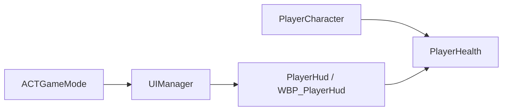

# 玩家生命值系统说明

本文档只说明 ACTGame 当前玩家生命值系统的结构组成、职责分工与运行时交互逻辑，不包含具体实现步骤。

---

## 一、系统定位

玩家生命值系统用于完成以下几类职责：

- 统一管理玩家的最大生命值与当前生命值。
- 对外提供加血、扣血与死亡事件广播能力。
- 在生命值变化时，向 UI 层广播最新数据。
- 由 HUD 统一负责玩家生命值界面的创建、初始化与销毁。

该系统当前由四个核心部分组成：

- `PlayerCharacter`：玩家角色本体，作为生命值组件的宿主。
- `PlayerHealth`：生命值数据与变更逻辑的唯一管理者。
- `PlayerHud`：生命值界面的表现层基类，负责接收生命值变化并驱动界面刷新。
- `UIManager`：继承自 `AHUD` 的 UI 管理器，负责创建和维护 `PlayerHud`。

---

## 二、系统结构

### 1. `PlayerCharacter`

`PlayerCharacter` 是玩家生命值系统的运行载体。

它的职责是：

- 挂载 `PlayerHealth` 组件。
- 作为 `UIManager` 和 `PlayerHud` 获取生命值组件的入口。
- 在角色存在期间，持续作为生命值数据的所属对象。

在当前结构中，`PlayerCharacter` 不直接处理 UI 刷新，也不直接管理血条控件，只负责提供 `GetPlayerHealth()` 访问入口。

### 2. `PlayerHealth`

`PlayerHealth` 是一个 `UActorComponent`，是玩家生命值系统的核心逻辑层。

它内部维护：

- `MaxHealth`：最大生命值，保证默认值大于 0。
- `CurrentHealth`：当前生命值，初始化时与最大生命值一致。
- `OnHealthChange`：生命值变化事件分发器，向外广播当前值和最大值。
- `OnPlayerDeath`：死亡事件分发器，在生命值归零时向外广播死亡状态。

它对外暴露两个核心接口：

- `AddHealth(float HealthAmount)`：处理增加生命值。
- `ReduceHealth(float HealthAmount)`：处理减少生命值，并在生命值归零时广播死亡事件。

所有生命值边界判断都收敛在 `PlayerHealth` 内部完成，包括：

- 加血时不能超过 `MaxHealth`。
- 扣血时不能低于 `0`。
- 非法输入或无效变化时直接忽略。

这意味着外部系统不需要重复判断边界，只需要调用接口并监听相应事件。

### 3. `PlayerHud`

`PlayerHud` 继承自 `UUserWidget`，是玩家生命值系统的 UI 表现层基类。

它的职责是：

- 在初始化时拿到玩家角色对应的 `PlayerHealth`。
- 绑定 `OnHealthChange` 事件。
- 在首次初始化时主动刷新一次界面。
- 在后续生命值变化时，通过统一事件更新血条与文本显示。

当前 `PlayerHud` 只保留一个核心更新入口：

- `UpdateHealth(float CurrentHealth, float MaxHealth)`

这个入口既用于初始化时的首次显示，也用于运行中的生命值变化刷新。  
在 C++ 层中它是 `BlueprintNativeEvent`，实际血条百分比和文本更新逻辑主要放在蓝图 `WBP_PlayerHud` 中完成。

### 4. `UIManager`

`UIManager` 继承自 `AHUD`，是当前生命值系统中的 UI 管理层。

它的职责是：

- 作为游戏 HUD 入口统一管理玩家 UI。
- 持有 `PlayerHudClass` 和 `PlayerHudInstance`。
- 在本地玩家存在时创建 `PlayerHud`。
- 在角色不存在时销毁 `PlayerHud`。
- 保证 HUD 生命周期与玩家角色状态保持一致。

当前 `UIManager` 默认尝试加载：

- `/Game/Blueprint/UI/WBP_PlayerHud`

也就是说，真正显示在屏幕上的生命值界面是 `WBP_PlayerHud`，而不是纯 C++ 的无图形界面。

### 5. `ACTGameMode`

`ACTGameMode` 的职责是把 `UIManager` 注册为默认 HUD。

这意味着生命值 UI 的入口不是玩家控制器组件，而是游戏模式所指定的 HUD 类。  
运行时由引擎创建 `UIManager`，再由 `UIManager` 创建实际的 `PlayerHud`。

---

## 三、数据流与交互关系

### 1. 静态结构关系

这条关系链可以概括为：

- `ACTGameMode` 决定使用哪个 HUD。
- `UIManager` 负责创建玩家界面。
- `PlayerHud` 从 `PlayerCharacter` 上获取 `PlayerHealth`。
- `PlayerHealth` 在数值变化时向 `PlayerHud` 广播最新生命值数据。

### 2. 初始化交互

系统初始化时的交互逻辑如下：

1. `ACTGameMode` 指定默认 HUD 为 `UIManager`。
2. 引擎创建 `UIManager`。
3. `UIManager` 在开始运行后尝试创建 `PlayerHud`。
4. `PlayerHud` 获取当前玩家角色。
5. `PlayerHud` 从玩家角色上取得 `PlayerHealth`。
6. `PlayerHud` 绑定 `PlayerHealth.OnHealthChange`。
7. `PlayerHud` 主动调用一次 `UpdateHealth(CurrentHealth, MaxHealth)`，把初始满血状态同步到界面。

这一步的意义是：

- 即使生命值在初始化阶段尚未发生变化，界面也能立即显示正确的初始血量。

### 3. 生命值变化交互

当外部系统直接调用生命值组件进行治疗或扣血时，交互逻辑如下：

1. 外部系统调用 `PlayerHealth.AddHealth()` 或 `PlayerHealth.ReduceHealth()`。
2. `PlayerHealth` 在内部完成边界修正。
3. `PlayerHealth` 更新 `CurrentHealth`。
4. `PlayerHealth` 广播 `OnHealthChange(CurrentHealth, MaxHealth)`。
5. `PlayerHud` 接收到事件后执行 `UpdateHealth(CurrentHealth, MaxHealth)`。
6. 蓝图界面更新进度条百分比以及当前/最大生命值文本。

当扣血导致生命值归零时，系统还会补充执行以下链路：

1. `PlayerHealth` 将 `CurrentHealth` 修正为 `0`。
2. `PlayerHealth` 广播 `OnPlayerDeath(true)`。
3. 外部需要处理死亡逻辑的系统通过绑定该事件获得通知。

在这个过程中：

- 生命值组件负责数据正确性。
- HUD 基类负责事件桥接。
- Widget 蓝图负责最终可视化表现。

需要注意的是，当前代码已经完成玩家生命值组件与 UI 链路，但玩家“受击入口”本身还没有接入最终方案。  
也就是说，`PlayerHealth.ReduceHealth()` 和 `OnPlayerDeath` 已经可用，但“玩家被谁调用、在何时调用”这部分目前仍待后续确定。

### 4. 销毁交互

当前结构下，界面销毁逻辑由 `UIManager` 统一负责。

当 `UIManager` 在运行中检测到当前玩家角色不存在时：

1. `UIManager` 调用 `DestroyUI()`。
2. `PlayerHudInstance` 从视口移除。
3. `PlayerHudInstance` 被置空。

这样可以保证：

- 玩家角色销毁后，旧血条不会残留在屏幕上。
- UI 生命周期不依赖 `PlayerHud` 自己维护，而由更上层的 HUD 统一管理。

---

## 四、职责边界

为了避免生命值系统职责混乱，当前结构中的边界划分如下：

### `PlayerHealth` 负责的内容

- 保存生命值数据。
- 处理加血与扣血逻辑。
- 保证生命值上下界合法。
- 广播生命值变化事件。
- 在生命值归零时广播死亡事件。

### `PlayerHud` 负责的内容

- 拿到生命值组件引用。
- 绑定生命值变化事件。
- 把生命值数据转交给界面更新入口。
- 作为 C++ 与 Widget 蓝图之间的桥接层。

### `UIManager` 负责的内容

- 创建界面。
- 销毁界面。
- 管理界面实例生命周期。
- 确保只在本地玩家有效时显示玩家 HUD。

### `PlayerCharacter` 负责的内容

- 提供生命值组件宿主。
- 为 UI 层提供访问 `PlayerHealth` 的入口。

这样的划分保证了：

- 数值逻辑不写进 UI。
- UI 生命周期不写进角色。
- 角色只承担宿主职责，不承担界面控制职责。

---

## 五、核心交互原则

当前玩家生命值系统遵循以下交互原则：

### 1. 单一数据源

玩家生命值只以 `PlayerHealth` 为准，其他类不保存另一套血量状态。

### 2. 事件驱动刷新

`PlayerHud` 不主动轮询生命值，而是通过 `OnHealthChange` 被动接收更新。  
初始化时只额外主动同步一次初始值，后续全部交由事件驱动。

### 3. 表现层与逻辑层分离

`PlayerHealth` 只处理数据，`WBP_PlayerHud` 只处理显示，二者通过 `PlayerHud` 进行衔接。

### 4. 生命周期由 HUD 统一托管

界面的创建与销毁由 `UIManager` 负责，而不是让 `PlayerHud` 自行管理存在状态。

### 5. 命名保持统一

当前生命值系统对外统一使用以下命名：

- `AddHealth`
- `ReduceHealth`
- `OnHealthChange`
- `OnPlayerDeath`
- `UIManager`

---

## 六、当前系统整体理解

从运行逻辑上看，这套玩家生命值系统可以概括为一句话：

`PlayerCharacter` 挂载 `PlayerHealth` 保存生命值，`UIManager` 创建 `PlayerHud` 负责显示，`PlayerHud` 通过绑定 `OnHealthChange` 把生命值变化实时同步到 `WBP_PlayerHud` 的血条和文本上，而其他系统可以通过 `OnPlayerDeath` 监听死亡通知。

当前这套结构更准确的定位是“玩家生命值数据与 UI 展示链路已经就绪”，而不是“玩家完整受击系统已经全部落地”。

这套结构的优点在于：

- 数据入口集中，生命值变化规则清晰。
- UI 只关心显示，不干预生命值计算。
- HUD 统一管理界面生命周期，结构稳定。
- 后续扩展受击反馈、低血量警告、死亡界面时，仍可以沿用当前事件驱动链路。
